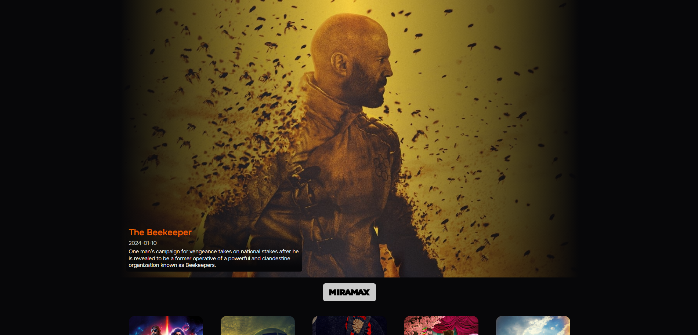

# MoviesAPP

1.- This project was generated with Angular 17.0.9.
2.- Using the API https://www.themoviedb.org/

## Development server

1.- `npm i` for all
2.- `ng serve` or `npm run start`for a dev server. Navigate to `http://localhost:4200/`. The application will automatically reload if you change any of the source files.

